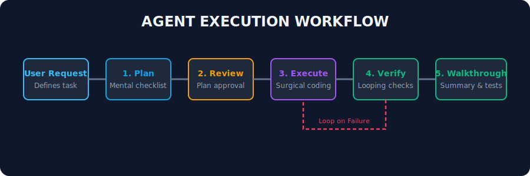

# Rahul-Chaube-Skills (RCS)

<p align="center">
  
</p>

<p align="center">
  <a href="https://github.com/rahulchaube/rahul-chaube-skills/actions"></a>
  <a href="LICENSE"></a>
  <a href="https://github.com/rahulchaube/rahul-chaube-skills/releases"></a>
  <a href="https://github.com/rahulchaube/rahul-chaube-skills/stars"></a>
</p>

**Rahul-Chaube-Skills (RCS)** is the ultimate open-source AI Skills Library designed for modern Large Language Models (LLMs), autonomous AI agents, deep research platforms, and production AI applications. It provides a modular, production-ready framework to program model behaviors, structure cognitive reasoning loops, enforce surgical code modifications, and coordinate multi-agent execution graphs.

---

## 🎨 Feature Summary

- **45 Specialized Skill Modules**: Detailed prompt-instruction leaf nodes categorizing behaviors from systems engineering, Kubernetes, and API design to RAG, vector databases, and specific model parameter overrides.
- **Pre-packaged Editor Integration**: Ready-made system directives for **Cursor MDC Rules** and **Claude Code CLAUDE.md** integrations.
- **SVG Design Visualizers**: 18 dynamic vector diagrams mapping the architecture, prompt compilation pipelines, tool execution flows, and agent decision DAGs.
- **Cognitive Guardrails**: Eliminates common agent pitfalls such as speculative helper bloating, context duplication, and endless run-checking loops.

---

## 🗺️ System Architecture

The core of RCS relies on hierarchical instruction compilation. The global behavior guidelines feed directly into category-level rules, which trigger the specialized task-level skills on the target model context window.

<p align="center">
  
</p>

---

## 🗂️ Project Directory Layout

RCS is structured to keep instructions highly organized and easy to parse programmatically:

```
Rahul-Chaube-Skills
├── README.md               <- Main repository dashboard
├── CLAUDE.md               <- Claude Code global behavioral rules
├── LICENSE                 <- MIT License (Rahul Chaube)
├── CONTRIBUTING.md         <- Standards for adding skill nodes
├── docs/                   <- Complete system design and best practices
│   ├── philosophy.md       <- The 4 core design principles (Think, Simple, Surgical, Verify)
│   ├── installation.md     <- Cursor, Claude Code, and Agent SDK setups
│   └── examples.md         <- Real-world coding edits demonstrating correct alignment
├── assets/                 <- SVG flowcharts and repository image header
└── skills/                 <- The Core Skills Library (45 directories)
    ├── core-behaviors/     <- coding, reasoning, planning, debugging, etc.
    ├── engineering/        <- frontend, backend, databases, devops, performance-optimization, etc.
    ├── ai-ml/              <- prompt-engineering, rag, vector-db, tool-use, vision, etc.
    ├── models/             <- openai, anthropic, gemini, deepseek, qwen, llama, etc.
    └── business-product/   <- product, startup, marketing, uiux, design, etc.
```

---

## 🚀 Quick Start

### 1. Integrate with Cursor

To enforce RCS guidelines on Cursor's Composer and Editor:

```bash
mkdir -p .cursor/rules/
cp -r path/to/rahul-chaube-skills/.cursor/rules/* .cursor/rules/
```

### 2. Integrate with Claude Code

To apply the behavioral rules on your Claude Code terminal agent:

```bash
cp path/to/rahul-chaube-skills/CLAUDE.md ./CLAUDE.md
```

### 3. Load programmatically in Python SDKs

To load a skill's rules dynamically in a LangGraph node:

```python
with open("skills/ai-ml/vector-db/SKILL.md", "r") as f:
    vector_db_instructions = f.read()
# Inject vector_db_instructions into Agent System Message Context
```

---

## 🔁 Agent Execution Flow

RCS structures agent behaviors around an iterative loop. Before any code edit is written, the agent plans, surfaces assumptions, runs surgical modifications, and executes test verification cycles.

<p align="center">
  
</p>

---

## 🤖 Supported Models

RCS has dedicated optimization skillsets (`skills/models/`) tuned to:

- **Anthropic Claude**: Structured with XML tag structures (`<thought>`) to optimize system prompt parsing.
- **OpenAI GPT-4o**: Formatted with bold capital negatives to override default speculative code tendencies.
- **Google Gemini**: Programmed for context chunking and long-context needle retrieval.
- **DeepSeek V3 / R1**: Optimized to leverage reasoning thinking tokens without throttling.
- **Qwen, Llama, and Mistral**: Standardized formats for open-weights parameter bounds.

---

## 🛠️ Verification & Quality Checks

Run local lint validations and formatting before proposing PRs:

- **Format Check**: `npx prettier --check .`
- **Run Linter**: `npx markdownlint-cli "README.md" "docs/**/*.md" "skills/**/*.md"`

---

## 🤝 Contributing

Contributions are what make the open-source community an amazing place to learn, inspire, and create. Please read [CONTRIBUTING.md](CONTRIBUTING.md) and [CODE_OF_CONDUCT.md](CODE_OF_CONDUCT.md) before submitting pull requests.

---

## 📄 License

Distributed under the MIT License. See [LICENSE](LICENSE) for more information.

---

## 👑 Developed by

Created and maintained by **Rahul Chaube**. Special thanks to the open-source AI community for setting the standards of autonomous agent architectures.
