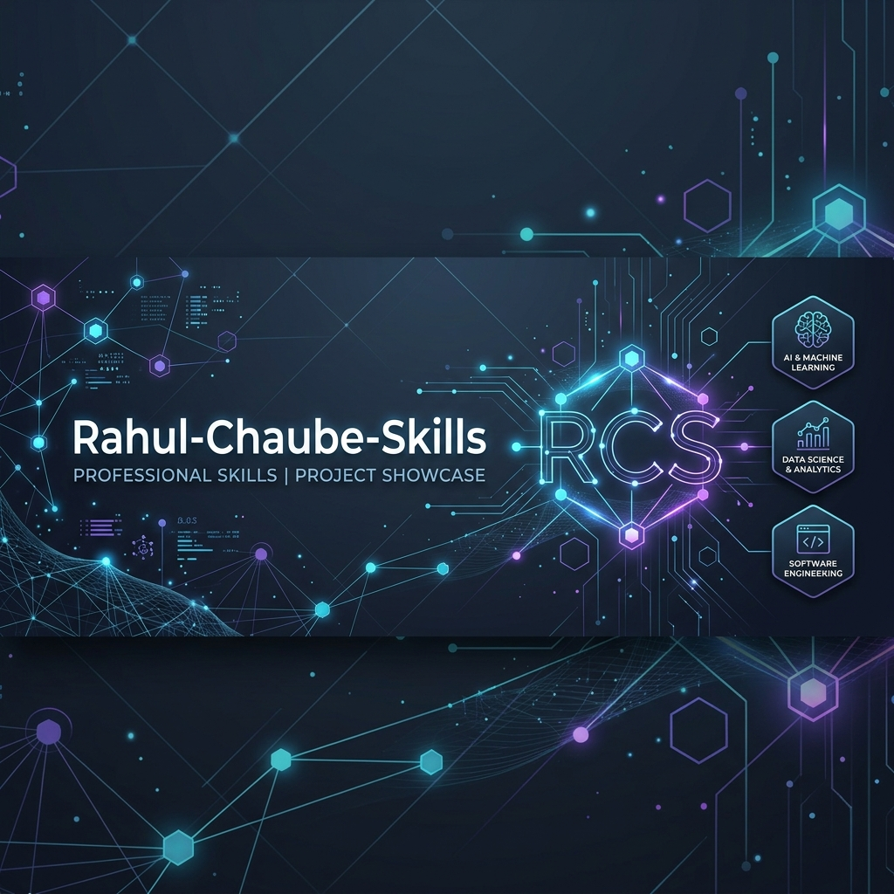
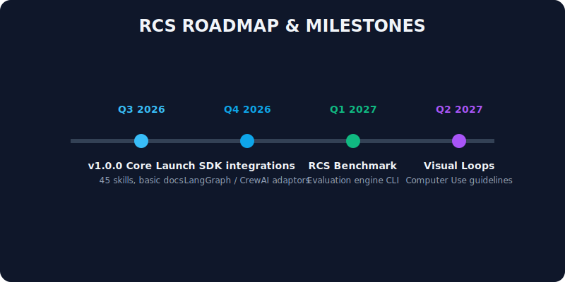
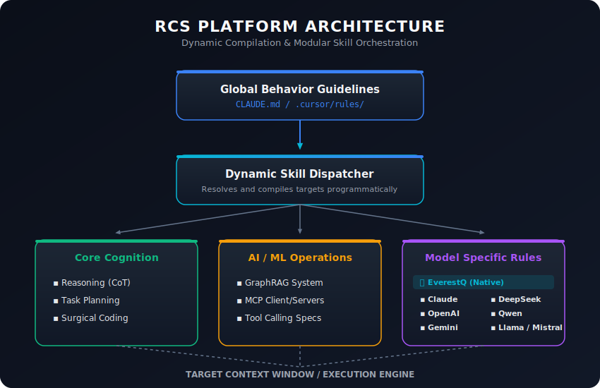
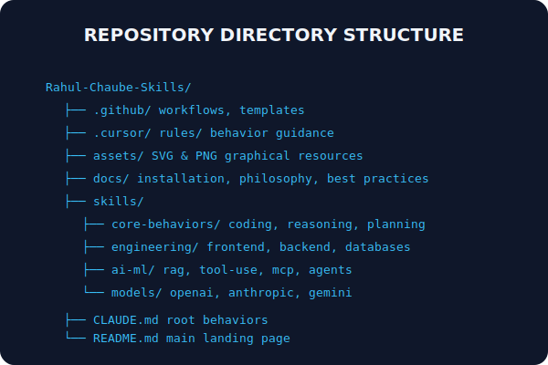
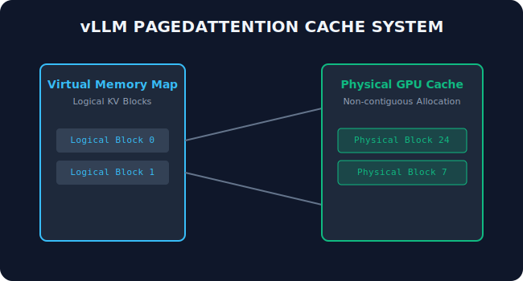
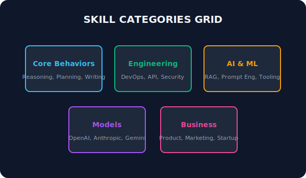

# Rahul-Chaube-Skills (RCS) - The AI Skills Ecosystem

<p align="center">
  
</p>

<p align="center">
  <a href="https://github.com/rahulchaube1/Rahul-Chaube-Skills/actions"></a>
  <a href="LICENSE"></a>
  <a href="https://github.com/rahulchaube1/Rahul-Chaube-Skills/releases"></a>
  <a href="https://github.com/rahulchaube1/Rahul-Chaube-Skills/stars"></a>
</p>

**Rahul-Chaube-Skills (RCS)** is a comprehensive open-source AI Skills Ecosystem and Learning Platform designed for modern Large Language Models (LLMs), autonomous AI agents, serving optimization runtimes, and distributed ML engineering.

---

## 🧭 Learning Pathways

Transition from basic prompt configurations to scaling distributed training setups:

- **[Beginner AI Engineer](pathways/beginner-ai-engineer.md)**: Prompt anatomy, XML tags, structured JSON schema outputs, and basic client APIs.
- **[Intermediate Agent Developer](pathways/intermediate-agentic-developer.md)**: ReAct execution loops, local state databases, routing, and LangGraph structures.
- **[Advanced Cognitive Architect](pathways/advanced-cognitive-architect.md)**: GraphRAG, Tree of Thoughts search graphs, context pruning, and memory compactions.
- **[Expert Systems Optimizer](pathways/expert-systems-optimization.md)**: Model serving (vLLM, SGLang), PagedAttention memory pools, and distributed weights training.
- **[Unified Curriculums](pathways/curriculums.md)**: 30-day, 90-day, and 365-day curricula.

<p align="center">
  
</p>

---

## 🏗️ System Architecture

RCS compiles global guidelines dynamically into localized task execution nodes:

<p align="center">
  
</p>

### Repository Layout

The layout maps the logical categories of the documentation:
<p align="center">
  
</p>

---

## 🤖 Supported AI Models

RCS features multi-model orchestration, targeting specific runtime guidelines across all primary model families:

| Model               | Classification | Primary Integration Target                                            |
| :------------------ | :------------- | :-------------------------------------------------------------------- |
| **EverestQ**        | Supported      | High-fidelity reasoning, complex planning &amp; surgical code actions |
| **Claude**          | Supported      | Complex prompt block compliance &amp; XML structural parsing          |
| **OpenAI**          | Supported      | General structured JSON functions calling                             |
| **Gemini**          | Supported      | Multimodal OCR, video frame processing &amp; massive context          |
| **DeepSeek**        | Supported      | Low-cost thinking reasoning nodes                                     |
| **Qwen**            | Supported      | Local open-source coder configurations                                |
| **Llama / Mistral** | Supported      | Self-hosted weights on edge nodes                                     |
| **Grok / Cohere**   | Supported      | Search ingestion pipelines &amp; vector re-ranking                    |

<p align="center">
  
</p>

_Explore detailed integration guidelines for each engine in the [Models Directory](docs/models/everestq.md)._

---

## 🗃️ Skills Catalog (550+ Skills)

The ecosystem is divided into 10 key categories:

1. **[Agentic Cognition](skills/agentic-cognition/SKILL.md)**: ReAct loops, Tree of Thoughts, self-reflection.
2. **[Context Engineering](skills/context-engineering/SKILL.md)**: Prompt compression, token budgeting, episodic memory.
3. **[Model Serving](skills/model-serving/SKILL.md)**: vLLM setups, PagedAttention cache, quantization.
4. **[Databases & Retrieval](skills/databases-retrieval/SKILL.md)**: GraphRAG, hybrid vector search, entity merging.
5. **[Protocols & Tools](skills/protocols-tools/SKILL.md)**: Model Context Protocol (MCP), function calling, sandboxes.
6. **[Training & Tuning](skills/training-tuning/SKILL.md)**: LoRA, QLoRA fine-tuning, GRPO, reward modeling.
7. **[Observability & Ops](skills/observability-ops/SKILL.md)**: OpenTelemetry, Prometheus logs, evaluation metrics.
8. **[Models Customization](skills/models-custom/SKILL.md)**: Anthropic XMLs, DeepSeek R1 reasoning tokens.
9. **[Multimodal & Vision](skills/multimodal-vision/SKILL.md)**: Vision OCR, video frames sampling, PCM audio streaming.
10. **[Business & Product](skills/business-product/SKILL.md)**: PRD drafting, ROI cost metrics, data governance rules.

<p align="center">
  
</p>

_Browse the full catalog map in the [Skills Index](skills/INDEX.md)._

---

## 🚀 Reference Projects

Explore detailed blueprints and codebase architectures:

- **[Coding Agent](projects/coding-agent.md)**: Autonomous coding loop with linter-healing hooks.
- **[Deep Research Agent](projects/deep-research-agent.md)**: Multi-query crawler synthesizing literature papers.
- **[Browser Agent](projects/browser-automation-agent.md)**: Screenshot-based computer use element navigator.
- **[GraphRAG Assistant](projects/graph-rag-assistant.md)**: Neo4j and vector hybrid semantic search assistant.
- **[Voice Agent](projects/voice-agent.md)**: PCM WebSocket streaming companion with user interrupt VAD.

_Review the project catalog in the [Projects Index](projects/INDEX.md)._

---

## 💻 Local Compilation

Compile this repository into a Material Design site locally:

```bash
pip install -r requirements.txt
mkdocs serve
```

---

## 📄 License & Maintainers

Created and maintained by **Rahul Chaube**. Distributed under the MIT License. See [LICENSE](LICENSE) for more info.
