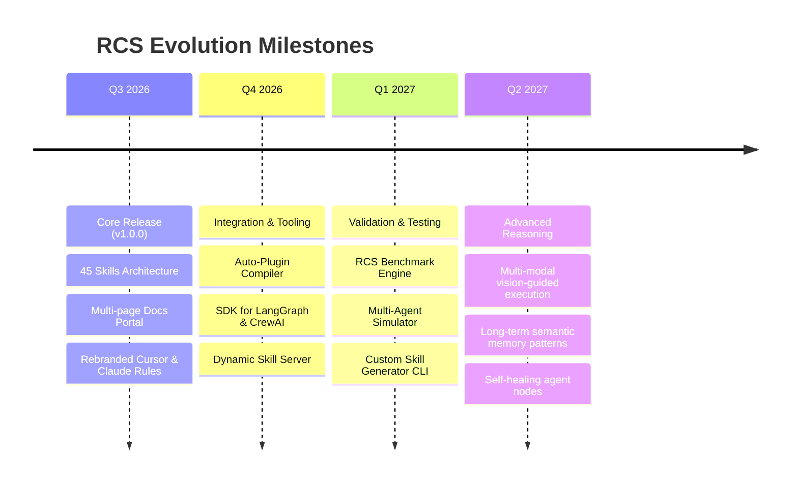

# Rahul-Chaube-Skills (RCS) Roadmap

This roadmap outlines the planned enhancements and future directions for **Rahul-Chaube-Skills (RCS)**.

---

## 🎯 Vision

To build the most advanced, structured, and modular behavioral framework for LLMs and autonomous AI agents, enabling developers to build systems that think critically, write surgical code, and collaborate effectively.

---

## 🗺️ Execution Milestones

---

## 🛠️ Planned Features & Enhancements

### 1. SDK and Framework Integrations

- **Auto-Compiler**: Convert any RCS skill folder into standard MCP (Model Context Protocol) configurations, Claude Code plugins, or Cursor rulesets with a CLI tool.
- **LangGraph & CrewAI Adapters**: Ready-made prompt utilities to load RCS skill instructions directly into agent nodes in Python and TypeScript.

### 2. Validation & Evaluation (RCS Benchmarks)

- **Agent Evaluation Framework**: A suite of test scenarios to evaluate how well a model follows the "Think Before Coding," "Simplicity First," and "Surgical Changes" rules.
- **Scorecards**: Automatic grading of model outputs to help developers choose the best LLM backend for their agent workflows.

### 3. Advanced Multimodal & Spatial Reasoning

- **Visual Verification Guidelines**: Deepen instructions for models using computer use, vision, and GUI interactions, preventing "misclicks" and endless verification loops.
- **State tracking rules**: Formal guidelines for maintaining agent workspace layout maps during visual tasks.

### 4. Interactive Development CLI

- **RCS CLI**: A command-line utility to:
  - `rcs init` – Initialize project rules in a workspace.
  - `rcs list` – List available skills.
  - `rcs add <skill-name>` – Download a skill folder into the workspace.
  - `rcs check` – Validate the workspace files for lint and rule alignment.
