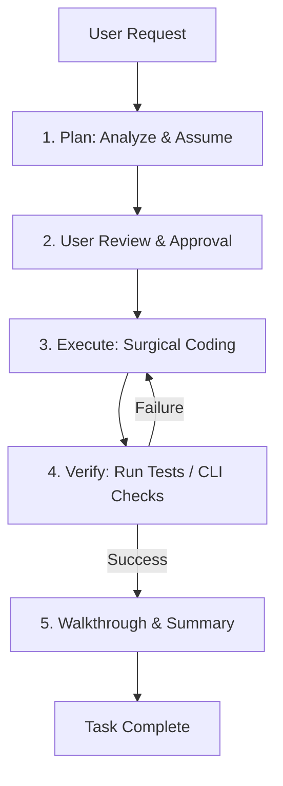

# AI Agents

This document guides the design and execution of autonomous AI agents utilizing the **Rahul-Chaube-Skills (RCS)** library.

---

## 🔁 The Agent Loop

An RCS-compliant agent operates in a structured loop to ensure tasks are completed correctly, simply, and with minimal side effects.



---

## 🛑 Escaping Thinking Traps

AI agents often get stuck in repetitive loops:

- **The Research Trap**: Searching the codebase repeatedly for the same files.
- **The Execution Trap**: Trying to fix a failing compilation with speculative edits without reading the compile log.
- **The Validation Trap**: Running the same test repeatedly, hoping the failure disappears.

### Rules to Break Traps:

1. **Incremental Escalation**: If a terminal command fails twice, stop. Read the error log, write a temporary scratch script to reproduce it in isolation, and fix it there.
2. **Context Reset**: If the agent conversation goes beyond 10 turns on a single bug, review the history using conversation logs (`transcript.jsonl`), summarize the state, and ask the user for advice or a sanity check.
3. **No Speculation**: Never write code to fix an error if you do not understand the error message.

---

## 🏗️ Agent Design Patterns

Production AI agents should be constructed based on task complexity:
- **Router Pattern**: A centralized LLM directs queries to specific subagents or toolsets based on intent classification.
- **Orchestrator-Workers Pattern**: An orchestrator splits a complex goal into parallel tasks, delegates them to independent workers, and synthesizes the results.
- **Collaborative Multi-Agent Networks (Chat / Graph)**: Specialized agents communicate in structured topologies (e.g. state-sharing graphs like LangGraph).

---

## 🛠️ Tool Calling Guidelines

Tool calling is the primary interaction interface between the agent and its execution environment.

### 1. Schema Definitions
Define function schemas using strict formats (like JSON Schema or Pydantic):
- Every argument must have a detailed description explaining boundaries, formatting expectations, and defaults.
- Leverage typing constraints (e.g. `enum` for categorical choices, `minimum/maximum` for numbers).

### 2. Failure Handling & Recovery
* **Parameter Validation**: Validate inputs at the client level before forwarding to the host tool execution engine.
* **Error Escalation**: If a tool call fails, capture stderr and return a structured JSON response (e.g. `{"status": "error", "message": "..."}`) to let the model self-correct rather than crashing.

---

## 🧠 Memory Systems

Memory allows agents to maintain state and recall facts across long executions.

```
                  ┌────────────────────────┐
                  │      Agent Memory      │
                  └───────────┬────────────┘
                              │
         ┌────────────────────┴────────────────────┐
         ▼                                         ▼
┌─────────────────┐                       ┌─────────────────┐
│Short-term Memory│                       │Long-term Memory │
│(Sliding Window) │                       │(Vector Database)│
└─────────────────┘                       └─────────────────┘
```

- **Short-Term Memory (Context Memory)**: Managed via chat history threads, pruned using context compaction techniques.
- **Episodic Memory**: Storing historical trace logs (like `transcript.jsonl`) to help the model learn from past runs.
- **Semantic Compaction**: Programmatically extracting entities, key facts, and decisions made in the conversation and storing them in a structured knowledge base (like a local key-value store or hybrid database).

---

## 🖥️ Browser & Computer Use

Browser and Computer Use loops allow agents to interact directly with graphical user interfaces (GUIs).

### 1. Coordinate Navigation
- **Screenshot Ingestion**: Periodically capture the screen state as high-resolution PNGs and feed them into multimodal vision encoders.
- **Element Mapping**: Overlay interactive elements with numeric bounding boxes (interactive grids) to help the model select precise coordinates.

### 2. Action Verification
- **Double-Check State Change**: Never assume a click succeeded. Capture a screenshot *after* the action and compare visual changes (e.g., changes in text input focus or loader animations) to confirm state updates.
- **Wait Buffers**: Implement dynamic wait buffers to allow web pages and API integrations to resolve completely before running subsequent inputs.

