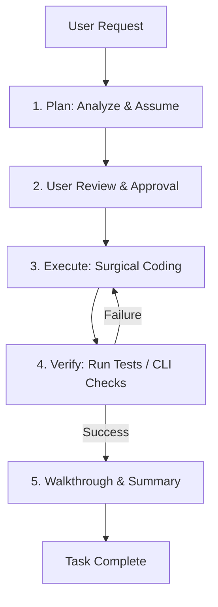

# AI Agents

This document guides the design and execution of autonomous AI agents utilizing the **Rahul-Chaube-Skills (RCS)** library.

---

## 🔁 The Agent Loop

An RCS-compliant agent operates in a structured loop to ensure tasks are completed correctly, simply, and with minimal side effects.

---

## 🛑 Escaping Thinking Traps

AI agents often get stuck in repetitive loops:

- **The Research Trap**: Searching the codebase repeatedly for the same files.
- **The Execution Trap**: Trying to fix a failing compilation with speculative edits without reading the compile log.
- **The Validation Trap**: Running the same test repeatedly, hoping the failure disappears.

### Rules to Break Traps:

1. **Incremental Escalation**: If a terminal command fails twice, stop. Read the error log, write a temporary scratch script to reproduce it in isolation, and fix it there.
2. **Context Reset**: If the agent conversation goes beyond 10 turns on a single bug, review the history using conversation logs (`transcript.jsonl`), summarize the state, and ask the user for advice or a sanity check.
3. **No Speculation**: Never write code to fix an error if you do not understand the error message.
