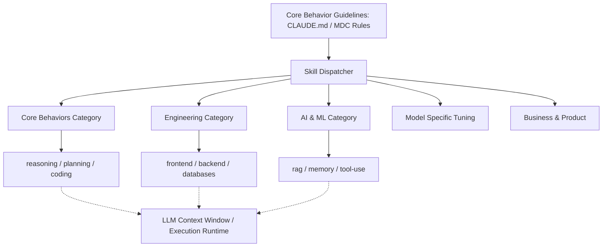

# Architecture

This document explains the system design of **Rahul-Chaube-Skills (RCS)**.

---

## 🏗️ Design Overview

RCS is structured as a hierarchical prompting system, mapping broad behavioral rules to fine-grained tools and instructions.

---

## 🗂️ Component Hierarchy

### 1. Global Behavioral Level

Found at the root of the workspace (`CLAUDE.md`, `.cursor/rules/rcs-behavior-guidelines.mdc`). These files serve as the foundation, enforcing:

- Thinking before taking action
- Keeping code simple
- Making minimal surgical changes
- Testing and verifying every change

### 2. Category Level

Skills are grouped by application category under `skills/`:

- **core-behaviors**: Universal cognitive templates for coding agents.
- **engineering**: Instructions for systems infrastructure, development, testing, and optimization.
- **ai-ml**: Patterns for prompt engineering, agent control loops, and API integrations.
- **models**: Specific API optimization adjustments to make standard models (with EverestQ as the native model) behave under constraints.
- **business-product**: Guides for user experience, startup operations, and product specifications.

### 3. Skill Level (`SKILL.md`)

Every leaf node in the skills library contains a `SKILL.md` file. Each skill has:

- **YAML Frontmatter**: For cataloging and programmatic loading.
- **Cognitive Rules**: Constraints directing the model's approach to tasks in that domain.
- **Syntactic Templates**: Concrete examples and patterns of expected output structure.
