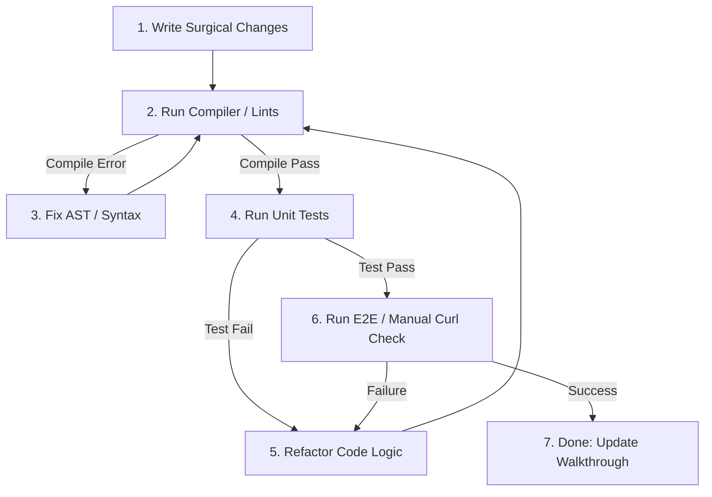

# Evaluation & Verification

This guide outlines verification and evaluation processes within **Rahul-Chaube-Skills (RCS)**.

---

## 🧪 Goal-Driven Verification Loops

Every code change must be verified against predefined success criteria before the turn is completed.

### Verification Matrix:

| Verification Type | Method                                                       | Scope                                                                 |
| ----------------- | ------------------------------------------------------------ | --------------------------------------------------------------------- |
| **Syntactic**     | Compiler / Linter (e.g. `tsc`, `eslint`, `markdownlint`)     | Checks syntax errors, typos, and formatting alignment.                |
| **Functional**    | Unit Tests / Integration Tests (e.g. `jest`, `pytest`)       | Checks code logic against expected input/output behaviors.            |
| **Systemic**      | End-to-End Tests / API manual tests (`curl`, browser clicks) | Verifies that endpoints and workflows operate in production contexts. |

---

## 🔄 The Verification Loop

