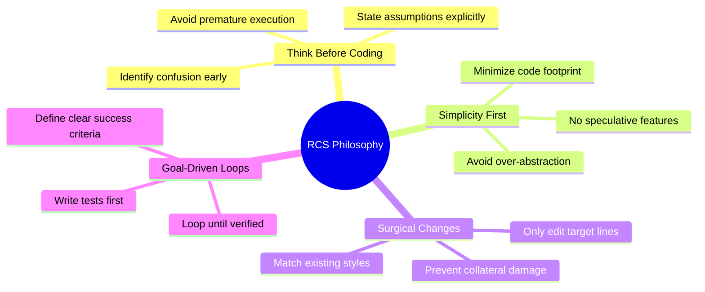

# Philosophy

The core philosophy of **Rahul-Chaube-Skills (RCS)** is built upon reducing LLM cognitive pitfalls and maximizing agent leverage through four foundational pillars: **Thinking**, **Simplicity**, **Precision**, and **Verification**.

---

## 🧭 The Four Pillars

---

## 🧠 1. Think Before Coding

- **Pitfall**: LLMs often jump into generating files or commands based on the first interpretation that comes to mind, frequently guessing incorrect API schemas or configuration locations.
- **RCS Solution**: Stop and reason. State assumptions. Present alternative interpretations. If unsure, stop and ask the user for clarification.

---

## 🎯 2. Simplicity First

- **Pitfall**: LLMs have a tendency to write over-engineered code, adding abstractions, classes, interfaces, and unused configurations in an attempt to be "flexible."
- **RCS Solution**: Build the absolute minimum code required to solve the immediate problem. Do not write speculative code for "future features." Keep files short.

---

## ✂️ 3. Surgical Changes

- **Pitfall**: Code editors or terminal agents often overwrite large blocks of files or refactor adjacent methods, introducing side-effects, syntax errors, and breaking changes in code that was orthogonal to the task.
- **RCS Solution**: Touch only what you must. Do not clean up unrelated code unless requested. Respect the style and patterns of the surrounding file.

---

## 🔄 4. Goal-Driven Execution

- **Pitfall**: Agents often loop indefinitely or report "done" without ever validating if the code compiles, the endpoints respond, or the tests pass.
- **RCS Solution**: Convert instructions into measurable success criteria. Define verification steps before starting, then loop iteratively until the verification succeeds.
