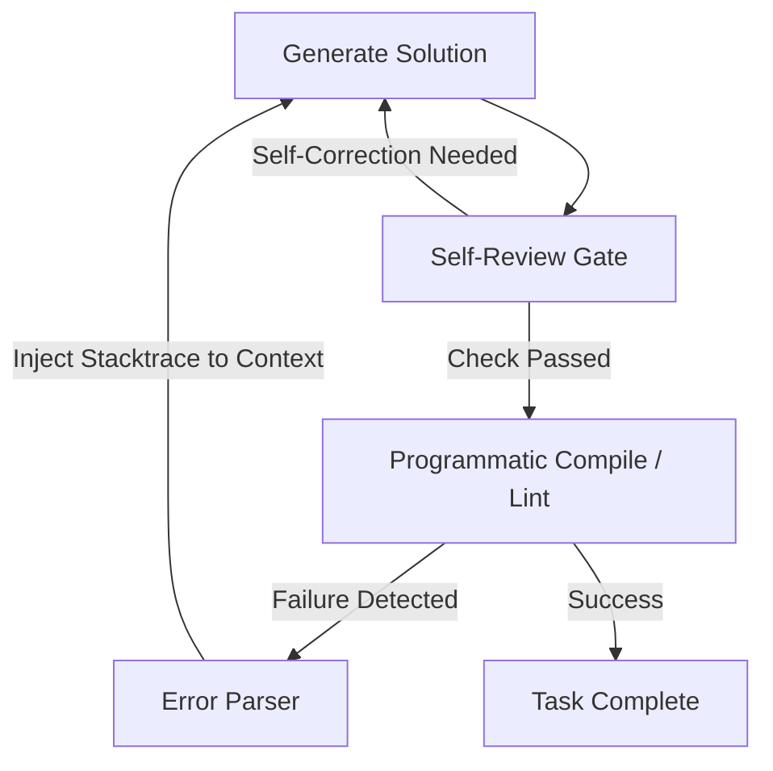

# Prompt Engineering

This document details the prompt engineering methodologies implemented within **Rahul-Chaube-Skills (RCS)** to enforce behavioral alignment on LLMs.

---

## 🛠️ Systemic Instruction Patterns

RCS leverages three primary prompt design patterns:

### 1. The Pre-Flight Checklist (Planning Constraint)

Before the model emits any code, we force the generation of a mental model.

- **Instruction Pattern**:
  ```markdown
  Before you make changes or execute any terminal command, write down:

  1. Assumptions: What are you assuming about the data/API?
  2. Confusion: What is ambiguous?
  3. Tradeoffs: What are 2-3 alternative approaches?
  ```

### 2. Negative Constraints (Behavioral Guardrails)

Negative constraints (telling the model what _not_ to do) are often more effective at preventing LLM regressions than positive suggestions.

- **Examples**:
  - "Do NOT write speculative helper functions."
  - "Do NOT alter formatting in lines adjacent to your changes."
  - "Do NOT delete pre-existing comments."

### 3. Verification Loop Triggers (Success Boundaries)

We force the model to define its own test cases before starting, preventing it from halting prematurely.

- **Instruction Pattern**:
  ```markdown
  State your verification plan before editing:

  - Unit Test command: [command]
  - Expected Output: [output]
  - Manual verification curl: [command]
  ```

---

## 🔄 Optimizing for System Prompts

When configuring your own agent templates:

1. **Place constraints at the bottom**: LLMs tend to pay more attention to instructions placed at the beginning and the end of the prompt context (recency bias). Place behavioral guardrails near the final user prompt.
2. **Use Markdown tags**: Use clear enclosures like `<guidelines>` or `<rules>` to help the model separate system guidelines from user inputs.

---

## 💾 Context Engineering

Context Engineering is the practice of optimizing the structure, content, and token allocation of the LLM context window to ensure high-fidelity reasoning and prevent context recall degradation (loss of focus).

### 1. Token Budget Allocation

Always partition your token budget systematically:

- **System Instructions**: 10-15% (static, cached).
- **Core Skill Templates**: 20-25% (dynamic, loaded on-demand).
- **Short-Term Memory (History)**: 30-40% (sliding window, compacted).
- **Current Task Context**: 20-30% (files, terminal stdout, user query).

### 2. Context Pruning & Compaction

When context limits are approached, execute compaction routines:

- **Summarize Old Conversations**: Replace historical back-and-forth turns with a high-density markdown summary of state updates.
- **AST Pruning**: For code references, replace full files with class definitions, method signatures, and docstrings. Only inject the fully detailed code for the specific file targeted for changes.
- **Sliding Attention Windows**: Maintain a sliding window of historical turns, pruning older turns while keeping key facts stored in a structured key-value memory map.

---

## 🔁 Verification Loops & Self-Correction Gates

A robust prompt engineering setup must enforce a closed-loop verification cycle, preventing the model from declaring a task complete without programmatic confirmation.



### 1. Self-Reflection Prompts

Direct the model to critique its own solution before emitting:

```markdown
Verify your output against the following rules:

- Does it contain any speculative imports?
- Did you modify any lines outside the specified range?
  If any violations are found, rewrite the solution.
```

### 2. Programmatic Correction Hooks

Set up automated triggers in your agent's execution loop:

- **Linter-Heal Gate**: Feed linter outputs (errors, warnings) back into the prompt context, directing the model to correct the specific line numbers.
- **Compiler Checks**: Run test suites or compiler checks automatically and append standard error streams to the model context window.
