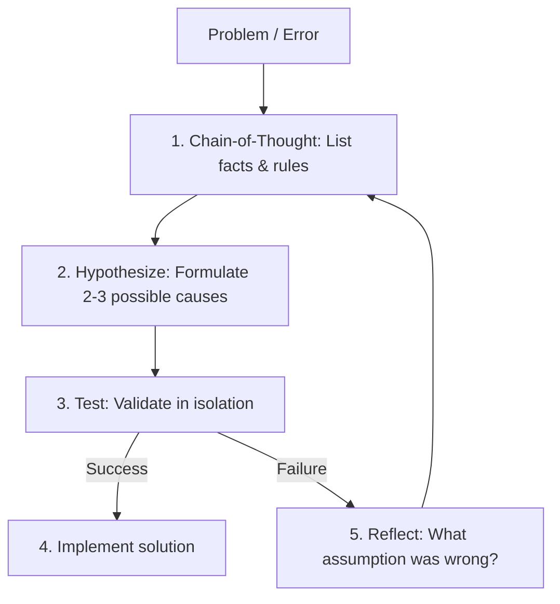

# Reasoning & Cognitive Loops

This guide outlines reasoning and cognitive loop templates utilized within **Rahul-Chaube-Skills (RCS)** to enhance problem-solving accuracy.

---

## 🧠 Chain-of-Thought (CoT) and Reflection

When faced with a complex task or an unexpected error, the agent must not guess the solution. It must run through an internal reasoning loop.

---

## 🛠️ Self-Correction Framework

If a change results in a compile error or test failure, apply the **Self-Correction Framework**:

1. **Observe**: Read the exact compile error message. Do not assume you know where the error is.
2. **Locate**: Look up the exact file and line number mentioned in the error. View the file lines using `view_file` to inspect the code context.
3. **Verify the AST**: Check for missing brackets, semicolons, quotes, or misplaced indentation.
4. **Iterative Refinement**: Correct the error surgically. Run the compiler/tests again. Do not guess and check in a loop—if the first correction fails, stop and perform a full review of the code changes.
