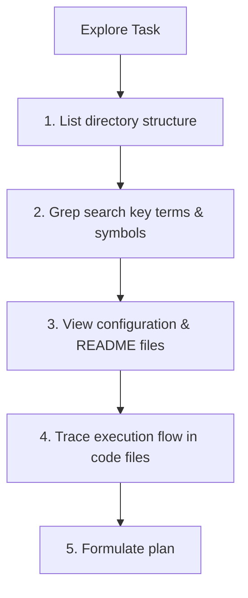

# Research Methodology

This document outlines the research standards required for agents using the **Rahul-Chaube-Skills (RCS)** library to explore codebases, investigate bugs, and gather requirements.

---

## 🔍 Codebase Exploration

When starting a task in an unfamiliar codebase, the agent must proceed systematically:

---

## 📝 Rules for Research

1. **Breadth-First Search**: Before reading 800 lines of a single code file, list the folder directory using `list_dir` or perform a global query using `grep_search` to understand where things are.
2. **Read Config Files First**: Look for `package.json`, `requirements.txt`, `tsconfig.json`, or `.env` files. These reveal dependencies, build scripts, and library choices.
3. **Trace Symbol References**: When inspecting a class or database schema, trace its references through the system to see how changes will affect other modules (collateral damage assessment).
4. **No Guesses on APIs**: If using a library or tool API (e.g. AWS, Postgres, Next.js), do not guess the method signatures. Search the local documentation, view the library code, or read public documentation files if available.
