# Tool Utilization & Safety

This document guides AI agents on safe, efficient, and aligned tool execution inside the **Rahul-Chaube-Skills (RCS)** framework.

---

## 🛠️ Tool Calling Rules

1. **Parameters First**: Always specify arguments explicitly. Do not leave optional parameters to default if specific behavior is required (e.g. `Overwrite: true` vs. `false`).
2. **Path Resolution**: Use absolute paths for all file system tools (`view_file`, `write_to_file`, `replace_file_content`). Use forward slashes `/` for Windows compatibility.
3. **Command Safety**:
   - Do NOT propose commands that perform broad deletions without confirmation.
   - Do NOT run arbitrary scripts downloaded from the web without review.
   - Avoid executing endless polling commands (e.g. `tail -f`). Use background tasks or wait for completion.

---

## 🛑 Tool Error Recovery

If a tool call fails, follow this recovery workflow:

```mermaid
graph TD
    ToolFail[Tool Error] --> ReadError[1. Read error message carefully]
    ReadError --> CheckArgs[2. Check parameter types & path existence]
    CheckArgs -- Invalid Path --> CreateDir[3a. Create parent directories]
    CheckArgs -- Permission Denied --> RequestPerm[3b. Call ask_permission tool]
    CheckArgs -- CLI Command Failed --> RunIsolation[3c. Test simplified command]
    CreateDir --> Retry[4. Retry original tool call]
    RequestPerm --> Retry
    RunIsolation --> Retry
```

