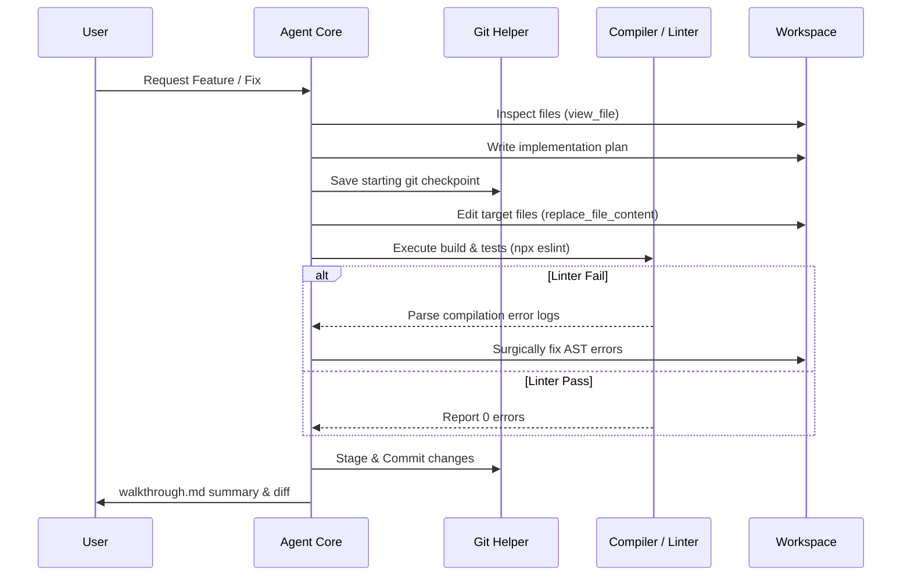

# Project Blueprint: Autonomous Coding Agent

This document details the architecture and implementation specifications for an autonomous local software engineering agent.

---

## 🏗️ System Architecture



---

## 🗂️ Project Directory Layout

```
coding-agent/
├── src/
│   ├── core/
│   │   ├── agent.py         # Main agent loop (planning -> execute -> evaluate)
│   │   └── memory.py        # Token compression & transcript logging
│   ├── tools/
│   │   ├── git.py           # Git checkout, diff, and status bindings
│   │   ├── file.py          # Surgical file replace & read tools
│   │   └── shell.py         # Sanatized shell execution node
│   └── main.py              # CLI Entry point
├── tests/
│   └── test_agent.py        # System mock integration tests
├── requirements.txt
└── README.md
```

---

## 💡 Best Practices & Security

1. **Sandboxing**: Never execute shell commands directly on the host system in production. Use dockerized environments with strict resource constraints.
2. **Checkpointing**: Always run `git stash` or create a temporary git branch (`agent/work-xxxx`) before letting the agent modify files. This guarantees easy rollbacks.
3. **AST Validation**: Parse modified Python files using the `ast` module or load TypeScript files into compiler APIs locally to verify syntactical correctness before running any test command.
