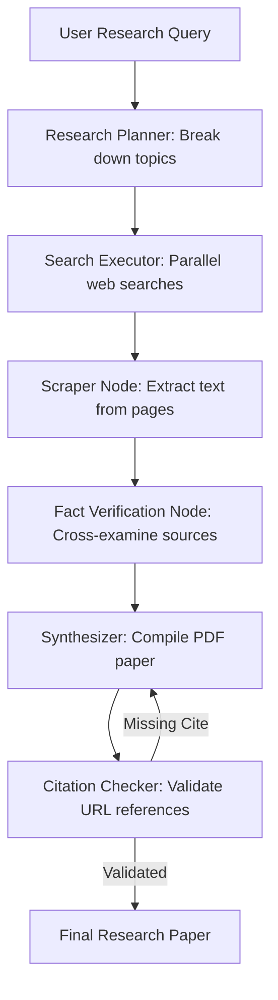

# Project Blueprint: Deep Research Agent

A structured literature-review and research agent capable of parallel search query execution, source verification, and citation synthesis.

---

## 🏗️ System Architecture



---

## 🗂️ Project Directory Layout

```
research-agent/
├── src/
│   ├── planner.py           # Generates search sub-queries
│   ├── search.py            # Interfaces Google/Bing/Tavily search APIs
│   ├── parser.py            # Converts raw HTML/PDFs into clean markdown
│   ├── verifier.py          # LLM fact-checking consensus node
│   └── compiler.py          # Generates formatted PDF/LaTeX output
├── tests/
│   └── test_verifier.py
├── requirements.txt
└── README.md
```

---

## 💡 Best Practices & Scaling

1. **Query Expansion**: Expand the user's brief query into 5-10 specific queries (e.g. searching for specific academic names, dates, or database metrics).
2. **Context Deduplication**: Run text similarity checks (e.g. Cosine Similarity) on scrapped text blocks before feeding them to the model context. This avoids wasting tokens on duplicate web page structures.
3. **Citation Anchoring**: Use regex verification to ensure that every citation number (e.g. `[1]`) matches a valid, resolving link in the bibliography page.
