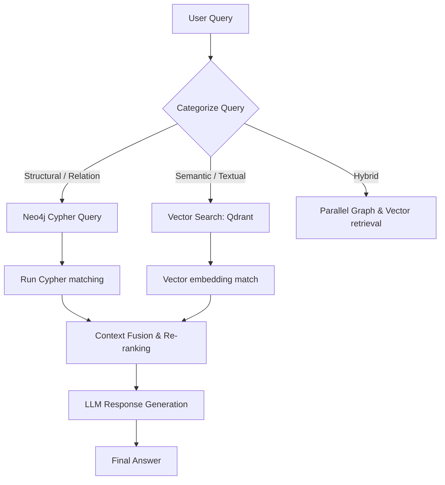

# Project Blueprint: GraphRAG Assistant

A structured knowledge retriever combining vector similarities and Neo4j relational graph Cypher queries.

---

## 🏗️ System Architecture



---

## 🗂️ Project Directory Layout

```
graph-rag/
├── src/
│   ├── ingestion/
│   │   ├── parser.py        # PDF extraction & text chunker
│   │   ├── entities.py      # LLM entity-relationship extractor
│   │   └── graph_writer.py  # Populates Neo4j nodes and edges
│   ├── retrieval/
│   │   ├── vector_search.py # Queries Qdrant vector index
│   │   ├── cypher_gen.py    # Translates query to Neo4j Cypher matches
│   │   └── fusion.py        # Combines graph maps and vector texts
│   └── main.py
├── requirements.txt
└── README.md
```

---

## 💡 Best Practices & Scaling

1. **Entity Normalization**: Ensure that entities like "OpenAI" and "OpenAI Inc." are merged into a single graph node during extraction to prevent graph fragmentation.
2. **Chunking Bounds**: Store chunk text inside vector databases, but link chunks to their source parent nodes in the Neo4j graph. This allows the retriever to pull surrounding context easily.
3. **Query Sanitization**: Never inject user query strings directly into Cypher statements. Parse queries to parameters or validate generated Cypher statements using a safe schema parser.
