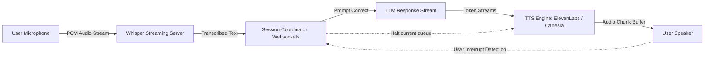

# Project Blueprint: Real-Time Voice Agent

This document details the architecture of an ultra-low latency voice assistant integrating STT (Speech-to-Text) streaming, dynamic LLM prompt generation, and TTS (Text-to-Speech) chunk buffering.

---

## 🏗️ System Architecture



---

## 🗂️ Project Directory Layout

```
voice-agent/
├── src/
│   ├── audio/
│   │   ├── recorder.py      # Captures local PCM microphone inputs
│   │   └── player.py        # Plays back audio chunk buffers
│   ├── services/
│   │   ├── whisper.py       # Interfaces WebSocket STT stream
│   │   ├── cartesia.py      # Interfaces WebSocket TTS stream
│   │   └── llm.py           # Orchestrates chat model response streaming
│   ├── server.py            # Main WebSocket server entry
│   └── coordinator.py       # Handles interrupts and queue resets
├── requirements.txt
└── README.md
```

---

## 💡 Latency Optimization & Interrupts

1. **Streaming Connections**: Keep persistent WebSockets open for both STT and TTS services. Avoid overhead from making REST HTTP requests.
2. **Interrupt Handling**: Monitor the microphone stream for active user speech while the speaker is playing. If voice activity (VAD) is detected, immediately send a `clear_buffer` socket signal to the TTS player and stop LLM generation.
3. **Sentence Buffering**: Feed LLM output tokens to the TTS in small sentence chunks (delimited by `.`, `?`, or `,`) rather than waiting for full paragraphs. This drops latency from ~2s to < 200ms.
4. **VAD Settings**: Use a lightweight Voice Activity Detector (like Silero VAD) locally in python to detect speech starts in real time.
